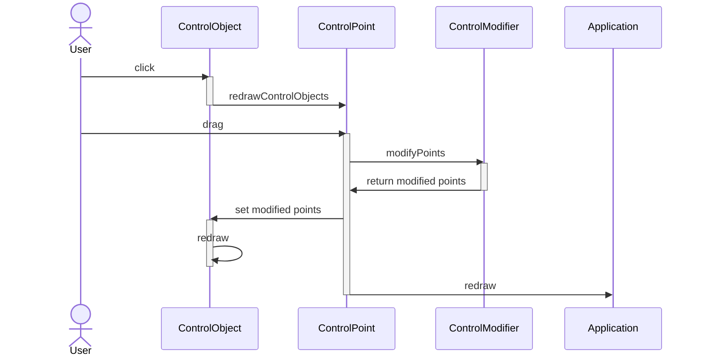

# Control objects - daign-2d-graphics

Control objects are the core element of a daign-2d-graphics application
and the template for all graphical elements that the user can interact with.

## Control points

A control object consists of an array of control point coordinates
and a set of instructions how to draw the desired shape based on the coordinates.

A line control object for example will typically contain two control points
for the endpoints.

However not every point in the resulting shape has to be a control point.
A rectangle control for example can also be defined by two control points for opposite corners.
The remaining two points for the resulting shape will be calculated from those.

And similarly a control point does not necessarily translate
into a point of the resulting shape.
For example it is possible to use a control point
whose position will translate into the hue of the object.

## Control point changes

When dragging a control point the redraw is automatically executed.
However multiple actions are executed beforehand which give you the possibility
to react to or modify control point changes.

The coordinate changes on the control point are channeled
through the control modifiers of the control object.
Coordinates can be adjusted at this point, even of control points which 
were not directly targeted by the drag.

After the coordinates have been channeled through the control modifiers,
they are written back to the control object.
This will then trigger a redraw of the control object.

Afterwards the [redraw of the application](./redraw-cycle.md) is automatically executed.

